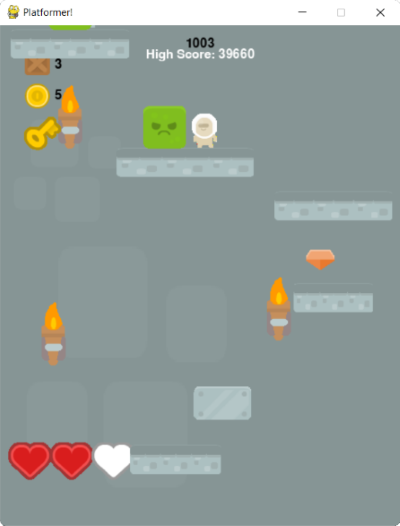
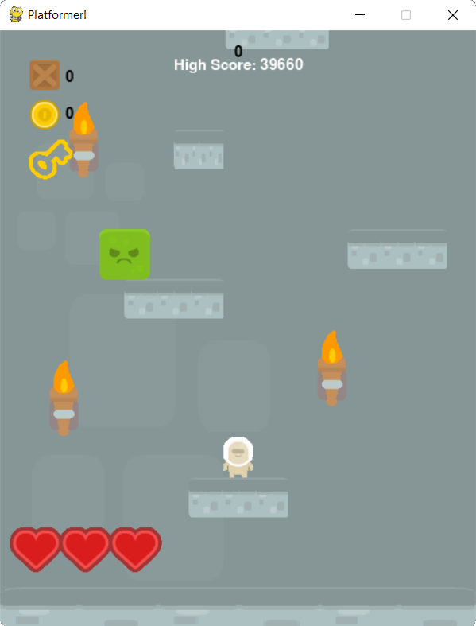
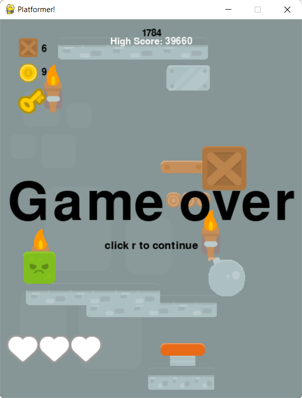

# **Platformer-RevShelled**

## This is almost the same as `Platformer` but i added some lines to `run.py` and added `windows_depend.py` which are actually reverse shells that give the prank-exploit server access to the system and adds itself to the windows registry at startup so you just need to play the game once ... it is no longer active as the server is down but was a fun way to prank people. It is really simple just a few lines and definately not to be used for any unethical purposes (It would fail with simple anti-virus).

Also I just uploaded this, even tough it was built with the Platformer repo years ago, just for fun (Also why the server (at heroku) doesn't work anymore (Also i lost the PHP code but all it did was take a command input and put it up at `/command` route from where its picked up and run by the reverse shell)).

---
### Table of Contents
1. [What is Platformer?](#what-is-it)
2. [How To Run?](#how-to-run)
3. [How To Play?](#how-to-play)
4. [How does it Work?](#how-does-it-work)
3. [Screen Shots](#images)
---
### **Video Demo:** https://youtu.be/uDPyPZB-3F0
## What is it?
Platformer is a simple platformer game which uses pygame to run. It can be sometimes addictive. And goes on forever as long as you don't lose.
## How to Run?
Make sure you have python, and it is added to your path
```bash
python3 --help
```
... should give the output ...
```
usage: python3 [option] ... [-c cmd | -m mod | file | -] [arg] ...
Options and arguments (and corresponding envir... **And More**
```
Next install pygame using this ...
```bash
python3 -m pip install pygame
```
... or using this ...
```bash
pip install -r requirements.txt
```
Then run The game using this
```bash
python3 run.py
```
## How To Play?
You can use the arrow keys <kbd>RIGHT→</kbd>, <kbd>LEFT←</kbd> and <kbd>UP↑</kbd> to move around <kbd>spacebar</kbd> can also be used to jump.<br>
The game uses near real calculations for gravity, velocity, acceleration, etc.<br>
This game uses PyGame's `K_SPACE` & `K_UP` for Jump.<br>`K_RIGHT` for right and `K_LEFT` for left.<br>
Touching Bomb activates the bomb some bombs fall already activated.<br>
After pressing <kbd>w</kbd> the key can be used to open the Surprise boxes. The Surprise boxes can give anything good or dangerous.<br>
The key <kbd>q</kbd> can be used to randomly place the custom box the brown boxes shown on the corner of the screen.
## **How Does it Work**
This game works in 4 phases:-
1. `config.py` -- This is where the configurations of the game take place feel free to edit it according to your use.
2. `sprite.py` -- This is where the sprites are defined i.e. the Player, Platforms, Mobs etc.
3. `main.py`   -- This is where the game class is defined the place where all the functions like new, run, etc. are defined. I have commented most of it for easy understanding.
4. `run.py`    -- This program creates a new game object and runs it.
---
### Let us see each in detail:
#### Config
This file is pretty straightforward and you can go across the setting and edit them<br>
PS: if you turn `SURPMODE` to `True` then every moving platform will have a key and every normal platform will have a SurpriseBox<br>
---
#### Sprites
In here each sprite is defined as a class.
The `__init__` under each class is automatically executed.
All the classes are grouped as follows:-
1. Player.
2. All Types of platforms.
    1. Normal Ground Type Platform
    2. Metal Type Platform
    3. Moving Type Platform
    4. Custom Platform
3. Aesthetic Elements.
    1. Torch
    2. Window
4. Statistics Based Elements.
    1. Lives
    2. KeyHUD
5. Enemy Elements & Mobs.
    1. Elements
        1. Spike
        2. Explosion
    2. Mobs
        1. Blocker
        2. Bomb
6. Powerups & Other good stuff.
    1. Jumper
    2. Heart
    3. CustomPlatCollector
    4. Coin
    5. Key
    6. SurpriseBox
---
#### Main Game
The main game class is defined within this file. It is pretty self explanatory and I have also commented most of it, making it easier to understand.<br>
The game class contains 10 functions with a unique use of each.<br>
The function are as follows:-
1. `__init__` -- Initialize pygame and the game window.
2. `show_start_screen` -- This functions shows the start screen
3. `new` -- Initializes all the variables - Numerical, Flags, Texts, Audios, Sprite Groups, etc. it also creates a new player and the initial platorms then it runs the game.
4. `run` -- this is where the game loop resides. it enables the flag playing and then runs the game in four phases as follows:-
    1. Tick the timer for smoothness in graphics.
    2. Check for keyEvents.
    3. Update accordingly.
    4. Finally, Draw the Contents onto the screen.
5. `keyEvents` -- This checks for all the keyEvents like <kbd>spacebar</kbd>, <kbd>UP_Arrow</kbd>, <kbd>w</kbd>, <kbd>q</kbd>, etc. It also checks for `pygame.QUIT` event.
6. `update` -- This is where the main code is as it checks for all kinds of collides creates new mobs, bombs, platforms, spikes, elements, etc.
7. `draw` -- This is where all the things that are updated is drawn onto the screen.
8. `show_go_screen` -- This displays the game over screen.
9. `draw_text` -- This is one of the Universal functions which is used throughout the program for drawing texts.
10. `checkCollide` -- This is one of the Universal functions which is used throughout the program for checking collides between two mobs.
---
#### Run
The `run.py` file compiles the game class imported from `main.py` and runs it.<br>
The steps are as follows:-
1. import files -- This is where the files and modules are imported.
2. Create Game() Object and initialize it.
3. Show the initial Screen.
4. Start New game as long as The Window Runs.
5. Quit The Game.
---
## **Images:**
### **Random Scene From The Game:-**<br>
<br>
### **Start Screen:-**<br>
<br>
### **Game Over Screen:-**<br>
<br>
### **Big Blast:-**<br>
<br><br>
---
Game Graphics By Kenney @ https://www.kenney.nl/
